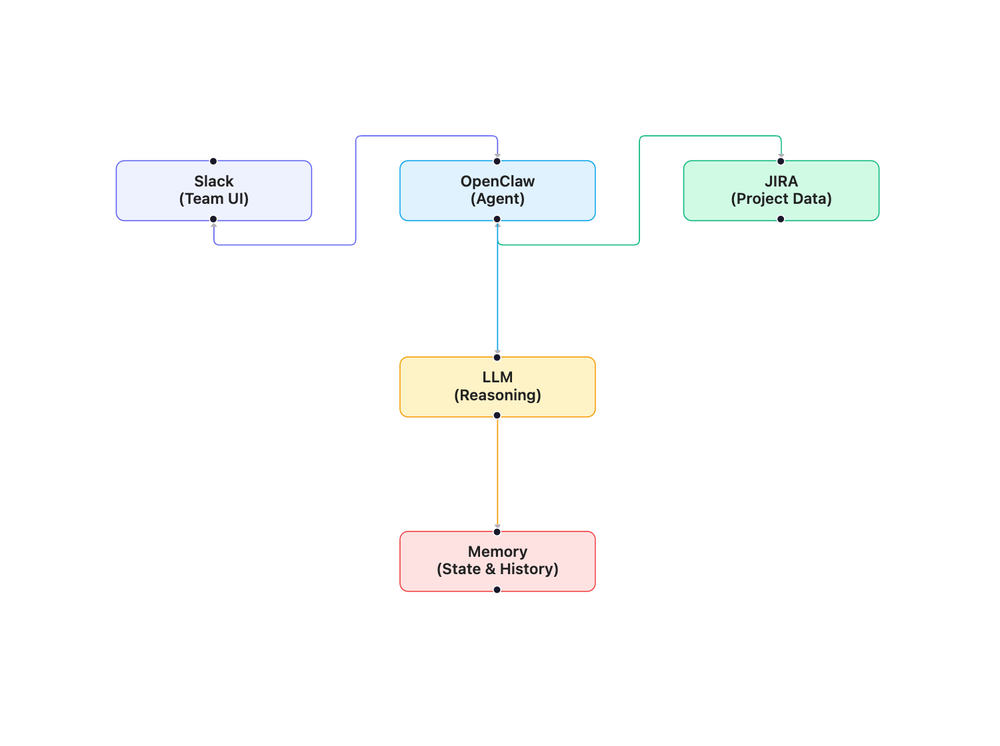

# Chapter 2: Discovering OpenClaw

I spent a Saturday afternoon googling "AI agent framework project management." The results were a mix of blog posts promising the future, GitHub repos with impressive READMEs and no documentation, and enterprise platforms that wanted me to book a demo before I could see a pricing page. I wasn't looking for a vision of the future. I was looking for something I could wire up to my JIRA board by Sunday night.

That search led me down a rabbit hole of AI agent tools — and eventually to OpenClaw. But before I explain why I chose it, it's worth understanding what's out there and why most of it didn't fit.

## The AI Agent Landscape

The term "AI agent" gets used loosely. A customer support chatbot is called an agent. A workflow automation that sends emails is called an agent. A research prototype that browses the web is called an agent. They're all different things, and the differences matter when you're trying to build something real.

For our purposes, here's a simple way to think about the landscape:

### Chatbots

A chatbot takes a question, sends it to a language model, and returns an answer. Some chatbots have access to a knowledge base — your company docs, a FAQ, a product manual — so they can answer questions about specific topics. They're good at answering questions. They're bad at *doing things*.

A chatbot can tell you "the sprint has 12 open tickets." It can't go read your JIRA board to figure that out on its own. Someone has to feed it the data first. For PM automation, that's a dealbreaker. The whole point is that the system reads the project state and acts on it — not that a human pre-digests the information and asks the chatbot to summarize it.

### Workflow Automation Tools

Tools like Zapier, Make, and n8n let you build "if this, then that" workflows. When a JIRA ticket moves to "Done," post a message in Slack. When someone fills out a form, create a JIRA ticket. These are useful and I still use some of them. But they're rule-based. Every trigger and every action has to be defined in advance.

The problem with rule-based automation for PM work is that project management is full of judgment calls. "Is this sprint at risk?" isn't a yes/no rule — it depends on how many tickets are open, how complex they are, who's working on them, what the dependencies look like, and how much time is left. You can't write a Zapier rule for that. You need something that can look at the situation and reason about it.

### No-Code AI Platforms

A newer category: platforms that combine a visual builder with AI capabilities. You drag and drop components, connect them to your tools, and the AI handles the "smart" parts. Some of these are genuinely useful for simple use cases — summarizing documents, classifying support tickets, generating reports from structured data.

But they tend to be opinionated about how you work. They have their own data models, their own UI, their own way of organizing projects. If your team already lives in JIRA and Slack, adding another platform creates friction. You want the AI to meet your team where they already are, not force them into a new tool.

### Agent Frameworks

This is where things get interesting. An *agent framework* gives you the building blocks to create an AI system that can:

1. **Understand instructions** written in natural language.
2. **Access external tools** — APIs, databases, communication platforms — to read data and take actions.
3. **Reason about what to do** based on the current situation, not just predefined rules.
4. **Execute multi-step workflows** where each step depends on the results of the previous one.

The key difference from chatbots: an agent doesn't just answer questions. It takes actions. The key difference from workflow automation: an agent doesn't follow rigid rules. It uses a language model to figure out the right steps based on context.

This is the category OpenClaw falls into. And it's the category that makes AI-powered project management practical.

## What Is OpenClaw?

OpenClaw is an open-source AI agent framework designed for building agents that integrate with real-world tools. It's not a PM tool — it's a general-purpose framework that happens to be very well suited for PM automation because of a few specific design choices.

At its core, OpenClaw does three things:

1. **Connects a language model to external tools.** You define the tools your agent can use — JIRA API, Slack API, a database, a calendar — and OpenClaw handles the plumbing. The agent can call these tools as part of its reasoning process.

2. **Manages agent behavior through configuration.** Instead of writing code for every scenario, you describe what the agent should do using prompts, rules, and workflow definitions. This makes it accessible to people who aren't AI researchers.

3. **Handles the operational complexity of running agents.** Context management, error handling, retry logic, conversation history, tool call orchestration — the stuff that's tedious to build from scratch but critical for a reliable system.

Think of OpenClaw as the layer between the language model (the brain) and your tools (the hands). The language model decides what to do. OpenClaw makes sure it can actually do it.

## Why OpenClaw for PM Automation?

I evaluated several agent frameworks before settling on OpenClaw. Here's what tipped the decision:

### Tool Integration Is a First-Class Concept

Some frameworks treat tool access as an afterthought — you can technically connect to external APIs, but the integration is fragile and poorly documented. In OpenClaw, tools are central to the architecture. Defining a new tool is straightforward, the framework handles authentication and error cases, and the agent's reasoning is built around tool use.

For PM automation, this matters a lot. Your agent needs to read JIRA boards, create tickets, post Slack messages, query sprint data, and update issue statuses. If tool integration is clunky, everything else falls apart.

### Configuration Over Code

OpenClaw leans heavily on configuration — YAML files, prompt templates, and declarative workflow definitions. You don't need to write a custom Python application to get an agent running. You define your tools, write your prompts, set your rules, and the framework handles execution.

This was important to me because I'm an infrastructure engineer, not an AI engineer. I wanted to spend my time on the PM logic — what the agent should do, how it should behave, what rules it should follow — not on building an agent runtime from scratch.

### Memory and Context Management

Agents need memory. When your AI PM summarizes a sprint, it needs to remember what it said yesterday so it can highlight what changed. When it collects standups, it needs to track who has responded and who hasn't. When it detects a blocker, it needs to know whether it already flagged that blocker or if this is new.

OpenClaw provides built-in mechanisms for *agent memory* — the ability to store and retrieve information across interactions. This includes short-term memory (within a single conversation or task) and long-term memory (across sessions and days). We'll use both extensively when building the AI PM.

### Active Community and Documentation

This is practical, not technical, but it matters. When you're building something new and you hit a wall at 11 PM on a Sunday, you need documentation that actually explains things and a community that answers questions. OpenClaw had both when I started, and it's grown since then.

## How OpenClaw Works: The Core Concepts

Before we start building in the next chapter, you need a working understanding of how OpenClaw is structured. Not a deep dive into the internals — just enough to make sense of what we'll be configuring.

### The Agent

An *agent* in OpenClaw is a configured entity that has:

- A **system prompt** that defines its role, personality, and rules. For our AI PM, this is where we'll say things like "You are a project management assistant for an engineering team. You help track sprint progress, collect standups, and detect blockers."
- A set of **tools** it can use. Each tool is a defined interface to an external system — a JIRA API endpoint, a Slack channel, a database query.
- **Memory** that persists across interactions. The agent can store facts, track state, and recall previous conversations.
- **Behavioral rules** that constrain what it can and can't do. "Never create a JIRA ticket without human approval." "Always include ticket IDs when referencing tasks." "If you're unsure about a priority, ask."

### Tools

A *tool* is anything the agent can interact with. In OpenClaw, you define tools by specifying:

- **What the tool does** — a description the language model uses to decide when to call it.
- **What inputs it needs** — the parameters required to make the call.
- **How to call it** — the API endpoint, authentication method, and request format.
- **What it returns** — the response format the agent will receive.

For example, a "get sprint board" tool might look like this:

```yaml
tools:
  get_sprint_board:
    description: "Retrieves all issues in the current active sprint from JIRA"
    parameters:
      board_id:
        type: string
        description: "The JIRA board ID to query"
    endpoint: "/rest/agile/1.0/board/{board_id}/sprint"
    method: GET
    auth: jira_api_token
```

The agent sees the description and parameters. When it decides it needs sprint board data, it calls this tool with the right board ID, gets back the results, and uses them in its response.

### Prompts

Prompts are how you tell the agent what to do. OpenClaw uses a layered prompt system:

- **System prompt:** The agent's identity and standing rules. Set once, applies to everything.
- **Task prompts:** Instructions for specific tasks. "Summarize the current sprint status" or "Collect standup updates from the team."
- **Context prompts:** Dynamic information injected at runtime. "Here's the current sprint data" or "These team members haven't submitted standups yet."

Good prompt design is one of the most important skills you'll develop in this book. The difference between an agent that gives useful sprint summaries and one that hallucinates ticket statuses often comes down to how well the prompt is written. We'll cover prompt engineering for PM tasks in detail starting in Chapter 4.

### Workflows

A *workflow* in OpenClaw is a sequence of steps the agent follows to complete a task. Each step can involve:

- Calling one or more tools
- Processing the results
- Making a decision about what to do next
- Generating output (a message, a report, an action)

For example, a "daily sprint summary" workflow might look like:

1. Call the JIRA API to get all tickets in the current sprint.
2. Group tickets by status (To Do, In Progress, In Review, Done).
3. Identify tickets that haven't moved in 2+ days.
4. Check for any tickets with "blocked" labels or comments mentioning blockers.
5. Generate a summary with progress stats, risk flags, and action items.
6. Post the summary to the team's Slack channel.

You define this workflow in OpenClaw's configuration, and the agent executes it — using the language model to handle the parts that require understanding (like reading comments for blocker mentions) and using tools for the parts that require action (like posting to Slack).

### Memory

OpenClaw's memory system has two layers:

**Short-term memory** holds information within a single session or task execution. When the agent is processing a sprint summary, it holds all the ticket data, intermediate calculations, and draft outputs in short-term memory. This is essentially the agent's working space.

**Long-term memory** persists across sessions. This is where the agent stores things like:

- Previous sprint summaries (so it can compare and highlight changes)
- Team member response patterns (so it knows who usually responds to standups late)
- Historical blocker data (so it can identify recurring issues)
- Decisions and their outcomes (so it can learn from past actions)

Long-term memory is what turns a stateless tool into something that feels like it knows your team. We'll build this up gradually — starting simple and adding memory capabilities as the system matures.

## The Technology Stack

Here's what we'll be working with throughout the book:

### OpenClaw (Agent Framework)

The core of the system. Handles agent configuration, tool orchestration, memory management, and workflow execution. You'll install it locally for development and deploy it to a server for production use.

### Large Language Model (LLM)

The "brain" of the agent. OpenClaw supports multiple LLM providers — OpenAI, Anthropic, and others. For this book, we'll primarily use OpenAI's models because they offer a good balance of capability, cost, and availability. But the patterns we build are model-agnostic — you can swap in a different provider without changing the agent's logic.

> **Note:** You'll need an API key from your chosen LLM provider. Chapter 3 covers setup in detail, including cost expectations and rate limit considerations.

### JIRA Cloud (Task Management)

Your project's source of truth for tasks, sprints, and workflows. The agent connects to JIRA through its REST API to read boards, query tickets, create issues, update statuses, and track sprint progress. You'll need a JIRA Cloud instance with API access — either your team's existing instance or a free-tier account for learning.

### Slack (Communication Layer)

The agent's interface with your team. It lives in Slack as a bot — posting summaries, collecting standups, answering questions, and sending notifications. You'll create a Slack app with the necessary permissions and connect it to OpenClaw.

### Supporting Infrastructure

For development, everything runs on your local machine. For production (Chapter 13), you'll need:

- A server or cloud instance to host the agent
- A database for long-term memory storage
- Basic monitoring and logging

We'll keep the infrastructure simple. The goal is a system that a single engineer can deploy and maintain, not an enterprise platform that requires a dedicated ops team.

## How the Pieces Fit Together

Here's the high-level architecture of what we're building:

<div align="center" style="border-bottom: none">
  
</div>

The flow works like this:

1. A trigger fires — a scheduled task (daily summary), a Slack message (someone asks a question), or a JIRA event (a ticket status changes).
2. OpenClaw receives the trigger and loads the relevant workflow.
3. The agent reads data from JIRA, Slack, and its own memory.
4. The LLM processes the data and decides what to do.
5. The agent takes action — posting a message, updating a ticket, storing a fact in memory.
6. The cycle repeats.

It's a loop: observe, reason, act. The same loop a human PM runs in their head all day — just automated and running continuously.

## What OpenClaw Doesn't Do

Being honest about limitations saves you time. Here's what OpenClaw won't handle for you:

**It doesn't replace prompt engineering.** OpenClaw gives you the framework, but the quality of your agent depends on the quality of your prompts. Writing good prompts for PM tasks is a skill you'll develop throughout this book. The framework makes it easier to iterate on prompts, but it doesn't write them for you.

**It doesn't guarantee correctness.** The agent uses a language model, and language models make mistakes. They hallucinate facts, misinterpret context, and occasionally produce confident nonsense. OpenClaw provides tools for validation and error handling, but you need to design your workflows with failure in mind. Chapter 5 is entirely about this.

**It doesn't handle organizational change.** Getting a team to trust and use an AI PM is a human problem, not a technical one. OpenClaw can power the system, but adoption depends on how you introduce it, how you handle mistakes, and how you demonstrate value. Chapters 11 and 12 cover this.

**It doesn't scale infinitely out of the box.** For a single team, OpenClaw runs comfortably on modest infrastructure. Scaling to multiple teams or an entire organization requires additional architecture — load balancing, multi-tenancy, data isolation. Chapter 13 addresses production scaling.

## Decisions to Make Before You Start

Before we set up the development environment in the next chapter, there are a few decisions worth thinking about. You don't need final answers yet — these will evolve as you build — but having a starting position helps.

### Which LLM Provider?

OpenClaw supports multiple providers. The main considerations:

- **OpenAI (GPT-4 and variants):** Widely used, well-documented, good balance of quality and cost. This is what we'll use in the book's examples.
- **Anthropic (Claude):** Strong at following complex instructions and handling nuanced text. A solid alternative.
- **Open-source models (Llama, Mistral):** Lower cost (you can self-host), but generally less capable for complex reasoning tasks. Worth considering if cost is a primary concern or if you have data privacy requirements that prevent using external APIs.

For getting started, I recommend using OpenAI. You can always switch later — the agent logic stays the same regardless of the model behind it.

### What's Your First Use Case?

Don't try to build everything at once. Pick one PM task to automate first. Good candidates for a first use case:

- **Sprint status summary.** Read the board, generate a summary, post it to Slack. Low risk, high visibility, easy to evaluate.
- **Async standup collection.** Ask team members for updates via Slack DM, compile the responses, post a summary. Replaces a meeting with an async workflow.
- **Blocker detection.** Scan the board for tickets that haven't moved, flag potential blockers. Catches things humans miss.

We'll start with sprint status summary in Chapter 4 because it's the simplest to build and the easiest to validate. But think about which use case would deliver the most value for your specific team.

### How Much Autonomy?

This is the most important design question, and it comes up repeatedly throughout the book. How much should the agent do on its own versus how much should it check with a human first?

The spectrum looks like this:

- **Read-only:** The agent reads data and generates reports but never takes action. Safest starting point.
- **Suggest and confirm:** The agent suggests actions (create this ticket, move this to blocked) and waits for human approval. Good balance of automation and control.
- **Act and notify:** The agent takes action and tells you what it did. Faster, but requires trust in the system.
- **Fully autonomous:** The agent acts without notification. Almost never the right choice for PM tasks.

Start with read-only. Move to suggest-and-confirm once you trust the agent's judgment. We'll discuss when and how to increase autonomy as the system matures.

## Looking Ahead

You now have a mental model of the landscape, the tools, and the architecture. You know what OpenClaw is, how it works at a high level, and what decisions you'll need to make.

The next chapter is where we get our hands dirty. You'll install OpenClaw, set up JIRA API access, create a Slack bot, and wire everything together. By the end of Chapter 3, you'll have a running agent that can read your sprint board and respond to questions in Slack.

It won't be smart yet. But it will be alive.

## Summary

- The AI agent landscape ranges from simple chatbots to full agent frameworks. For PM automation, you need a framework that combines language understanding with real tool access and multi-step reasoning.
- OpenClaw is an open-source agent framework that connects language models to external tools through configuration rather than custom code. It handles tool orchestration, memory management, and workflow execution.
- The technology stack for our AI PM is: OpenClaw (agent framework), an LLM (reasoning), JIRA (project data), Slack (team communication), and a memory layer (state and history).
- Before starting, decide on your LLM provider, your first use case, and your initial autonomy level. Start simple — read-only sprint summaries are a good first target.
- OpenClaw provides the framework, but the quality of your AI PM depends on prompt design, failure handling, and the human work of building team trust.
